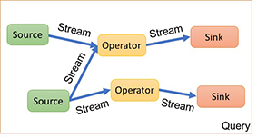
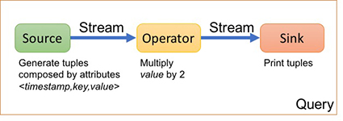

[](../index)

## The basics



A streaming application runs a **query**, a directed acyclic graph of **sources**, **operators** and **sinks** connected by **streams**:

1. Sources produce tuples.
2. Operators consume input tuple and produce output tuples.
3. Sinks consume tuples.

When you create your query, you add sources, operators and sinks and connect them with streams.

#### A first example (complete example [here](https://github.com/vincenzo-gulisano/Liebre/blob/master/src/test/java/example/SimpleQuery.java))

In this example, a source creates a stream of tuples with attributes _&lt;timestamp,key,value&gt;_ and feeds them to an operator that multiplies the value by 2. This operator feeds its output tuples to a sink that prints them.



```java
public class SimpleQuery {

  public static void main(String[] args) {

    Query q = new Query();
    Source<MyTuple> source = q.addBaseSource("I1", new SourceFunction<MyTuple>() {
      private final Random r = new Random();

      @Override
      public MyTuple get() {
        Util.sleep(50);
        return new MyTuple(System.currentTimeMillis(), r.nextInt(5), r.nextInt(100));
      }
    });

    Operator<MyTuple, MyTuple> multiply = q
        .addOperator(new BaseOperator1In<MyTuple, MyTuple>("M") {
          @Override
          public List<MyTuple> processTupleIn1(MyTuple tuple) {
            List<MyTuple> result = new LinkedList<MyTuple>();
            result.add(new MyTuple(tuple.timestamp, tuple.key, tuple.value * 2));
            return result;
          }
        });

    Sink<MyTuple> sink = q.addBaseSink("O1",
        tuple -> System.out.println(tuple.timestamp + "," + tuple.key + "," + tuple.value));

    q.connect(source, multiply).connect(multiply, sink);

    q.activate();
    Util.sleep(30000);
    q.deActivate();

  }

  private static class MyTuple {

    public long timestamp;
    public int key;
    public int value;

    public MyTuple(long timestamp, int key, int value) {
      this.timestamp = timestamp;
      this.key = key;
      this.value = value;
    }
  }
}
```

Please notice:

1. You can define a class for your tuples (MyTuple in the example).
2. You can add a source to your query using the method _addBaseSource_. For this method, you provide:
	- an id for the source.
	- an instance of _SourceFunction_, for which you specify the method _get_.
3. You can add an operator to your query using the method _addOperator_. For this method, you provide:
	- an id for the operator.
	- an instance of _BaseOperatorIn1_, for which you specify the method _processTupleIn1_. The _BaseOperatorIn1_ allows you to return more than one tuple for each incoming tuple. If no tuple is returned, the method can return an empty list.
5. You can add a sink to your query using the method _addBaseSink_. For this method, you provide:
	- an id for the sink.
	- an instance of _SinkFunction_, for which you specify the method _accept_. Notice that, as shown in the example, Lambda expressions can also be used for compact notation.
6. Finally, you connect the source to the operator and the operator to the sink with the method _connect_.
7. You can activate and de-activate the query with methods _activate_ and _deactivate_.
