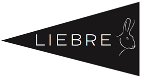

Here you can find documentation about the [Liebre stream processing engine](https://github.com/vincenzo-gulisano/Liebre).
Some motivation about this project can be found [here](https://vincenzogulisano.com/2017/07/09/the-liebre-stream-processing-engine/).

If you have any questions, please write to [info@vincenzogulisano.com](mailto:info@vincenzogulisano.com)

Documentation:

1. [Basic concepts](docs/basics.md)
2. [Sources, operators and sinks](docs/sourcesopssinks.md)
3. [Statistics](docs/stats.md)

Please notice: you probably want to have a look at some of the papers you can find in my webpage (and the references they cite) to get familiar with some of the concepts discussed in the documentation (e.g., *deterministic* processing).